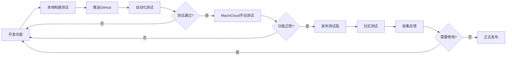

# macOS构建和测试 - 快速参考

> 一页纸看懂如何构建和测试macOS应用，不需要MAC电脑！

---

## 🚀 5分钟快速开始

### 步骤1: 推送代码到GitHub
```bash
git add .
git commit -m "准备构建macOS版本"
git push origin main
```

### 步骤2: 查看自动化构建
1. 访问: https://github.com/你的仓库/actions
2. 等待10-15分钟
3. 下载DMG文件

### 步骤3: 快速测试
- **GitHub Actions**: 自动测试已完成
- **MacinCloud**: 注册1小时免费试用
- **社区测试**: 分发给朋友测试

---

## 📊 方案速查表

### 构建方案

| 需求 | 方案 | 命令 | 时间 |
|------|------|------|------|
| **自动化构建** | GitHub Actions | `git push` | 10-15分钟 |
| **快速测试** | Windows本地 | `.\build-mac.bat` | 5-10分钟 |
| **专业发布** | macOS本地 | `npm run electron:build-mac` | 5-10分钟 |

### 测试方案

| 需求 | 方案 | 成本 | 真实度 |
|------|------|------|--------|
| **自动化测试** | GitHub Actions | 免费 | ⭐⭐⭐⭐ |
| **手动测试** | MacinCloud | 1小时免费 | ⭐⭐⭐⭐⭐ |
| **真实反馈** | 社区测试 | 免费 | ⭐⭐⭐⭐⭐ |

---

## 💻 常用命令

### 在Windows上构建
```powershell
# 进入PC版本目录
cd pc-version-final

# 快速构建（使用脚本）
.\build-mac.bat

# 或手动构建
npm run electron:build-mac

# 查看输出
ls dist\
```

### 在macOS上构建
```bash
# 进入PC版本目录
cd pc-version-final

# 创建图标
./create-mac-icon.sh

# 构建应用
npm run electron:build-mac

# 查看输出
ls -lh dist/
```

### 触发GitHub Actions
```bash
# 方式1: 推送代码
git push origin main

# 方式2: 创建Release
git tag v1.0.0
git push origin v1.0.0

# 方式3: 手动触发
# 访问GitHub Actions页面 → Run workflow
```

---

## 🧪 测试检查清单

### 自动化测试（GitHub Actions）
- [ ] 推送代码到GitHub
- [ ] Actions运行成功
- [ ] 下载DMG文件
- [ ] 检查文件大小（应该>100MB）

### 手动测试（MacinCloud）
- [ ] 注册MacinCloud账号
- [ ] 连接到云端MAC
- [ ] 上传并安装DMG
- [ ] 测试核心功能（15分钟）

### 社区测试
- [ ] 创建GitHub Release
- [ ] 发布测试邀请
- [ ] 分发测试指南
- [ ] 收集反馈

---

## 📁 文件位置速查

### 配置文件
```
.github/workflows/
  ├── build-macos.yml          # macOS构建配置
  └── test-macos.yml           # macOS测试配置

pc-version-final/
  ├── package.json              # 构建脚本
  ├── build-mac.bat             # Windows构建脚本
  ├── create-mac-icon.sh        # macOS图标生成
  └── build/
      └── entitlements.mac.plist # macOS权限配置

docs/
  ├── macOS桌面版构建方案.md          # 方案总结
  ├── macOS应用测试方案.md            # 测试详解
  └── macOS测试指南-给测试者.md       # 用户指南
```

### 输出文件
```
pc-version-final/dist/
  ├── XinTuAlbum-1.0.0-x64.dmg      # Intel版本
  ├── XinTuAlbum-1.0.0-arm64.dmg    # Apple Silicon版本
  ├── XinTuAlbum-1.0.0-x64.zip      # 便携版（可选）
  └── XinTuAlbum-1.0.0-arm64.zip    # 便携版（可选）
```

---

## 🔗 快速链接

### GitHub Actions
- 构建日志: `https://github.com/你的仓库/actions`
- Releases: `https://github.com/你的仓库/releases`
- Artifacts下载: Actions页面 → 具体workflow → Artifacts

### 测试服务
- MacinCloud: https://www.macincloud.com
- MacStadium: https://www.macstadium.com
- AWS Mac: https://aws.amazon.com/ec2/instance-types/mac/

### 工具文档
- electron-builder: https://www.electron.build/
- GitHub Actions: https://docs.github.com/actions
- Apple签名: https://developer.apple.com/support/code-signing/

---

## ❓ 常见问题速查

### Q: 需要MAC电脑吗？
**A:** ❌ 不需要！使用GitHub Actions或在Windows上构建。

### Q: 构建需要多久？
**A:** 
- Windows本地: 5-10分钟
- GitHub Actions: 10-15分钟
- macOS本地: 5-10分钟

### Q: 如何测试？
**A:** 
1. GitHub Actions自动测试（免费）
2. MacinCloud手动测试（1小时免费）
3. 社区用户测试（免费）

### Q: 需要Apple开发者账号吗？
**A:** ❌ 不必须！但有账号可以代码签名。

### Q: 构建失败怎么办？
**A:** 
1. 检查 `package.json` 配置
2. 确保 `public/icon.png` 存在
3. 查看GitHub Actions日志
4. 清理重新构建: `npm run build`

### Q: 用户无法打开应用？
**A:** 让用户：
1. 右键点击应用
2. 选择"打开"
3. 点击确认

---

## 💡 最佳实践

### 日常开发
```bash
# 每次提交自动测试
git commit -m "feat: 新功能"
git push
# → GitHub Actions自动构建和测试
```

### 周度测试
```bash
# 每周手动测试一次
# 1. MacinCloud测试（1小时）
# 2. 检查核心功能
# 3. 记录问题
```

### 发布前
```bash
# 1. 完整测试
git tag v1.0.0
git push origin v1.0.0

# 2. 社区测试（7天）
# - 发布测试邀请
# - 收集反馈
# - 修复问题

# 3. 正式发布
git tag v1.0.1
git push origin v1.0.1
```

---

## 🎯 推荐工作流



---

## 📞 获取帮助

### 遇到问题？
1. **查看文档**: 
   - [BUILD_GUIDE_MAC.md](../pc-version-final/BUILD_GUIDE_MAC.md)
   - [macOS应用测试方案.md](./macOS应用测试方案.md)

2. **查看示例**:
   - GitHub Actions日志
   - 成功构建的Artifacts

3. **寻求帮助**:
   - GitHub Issues
   - 社区讨论
   - 技术论坛

---

## ✅ 快速检查清单

### 构建前
- [ ] `package.json` 配置正确
- [ ] `public/icon.png` 存在
- [ ] 依赖已安装: `npm install`
- [ ] React构建成功: `npm run build`

### 构建后
- [ ] DMG文件已生成
- [ ] 文件大小正常（>100MB）
- [ ] 两个架构都有（x64 + arm64）
- [ ] 可以正常打开DMG

### 测试前
- [ ] 测试环境准备好
- [ ] 测试清单准备好
- [ ] 反馈渠道建立好

### 发布前
- [ ] 所有测试通过
- [ ] 用户反馈已收集
- [ ] 问题已修复
- [ ] 版本号已更新

---

**🎉 现在你已经掌握了完整的macOS构建和测试流程！**

**下一步**: 
1. 推送代码触发构建
2. 注册MacinCloud测试
3. 发布社区测试邀请

